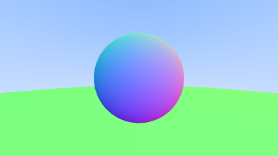
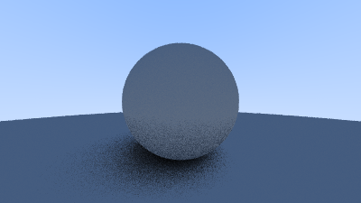
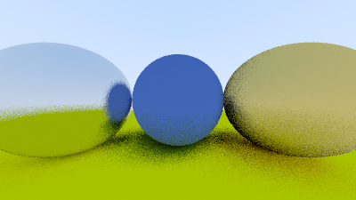
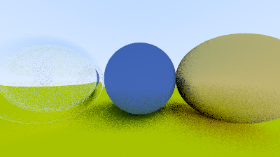

# raytracer

A Ray Tracer* in C++.

## Images

Added various surfaces including metals, dielectrics and lambertian surfaces.

### Gradients

Gradients

### Anti-aliasing

### Diffusion surfaces

Lambertian

### Variable Gamma

Variable gamma

### Metallic/Reflective surfaces

Metals

### Refractive surfaces

Glass surfaces

### Variable camera position

### Depth of Field

## Final Render

## Reference

[_Ray Tracing in One Weekend_](https://raytracing.github.io/books/RayTracingInOneWeekend.html)

* = Technically a path tracer, but we will improve upon it.

